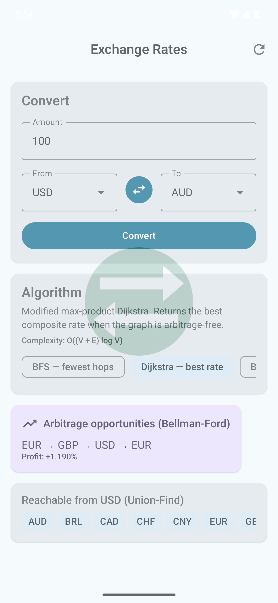
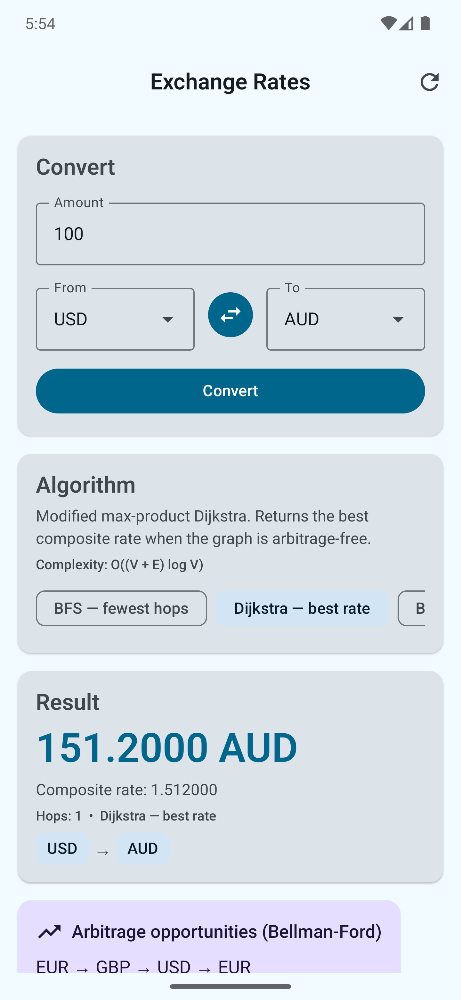

# Exchange Rates

> A single-screen Android app rebuilt as a teaching reference for graph algorithms, classic data structures, and Gang of Four design patterns. It happens to convert currencies because the rate table is a natural graph.

Not a production app. No auth, no analytics. A live backend (Frankfurter, https://www.frankfurter.dev/) *is* wired up but isn't the default — the embedded rate dataset is hand-curated and intentionally contains an arbitrage triangle so Bellman-Ford has something to find on first launch.

The intended audience is a candidate studying for an interview, or an interviewer who wants something concrete to pick apart. Every algorithm carries step-by-step pedagogical comments. Every Gang of Four pattern is wired live; nothing is in the repo "for show".

<p align="center">
  
  &nbsp;&nbsp;
  
</p>

The first screenshot is the cold-start state — Dijkstra is the default strategy, the rate-graph has already been folded by Bellman-Ford into the arbitrage card (`EUR → GBP → USD → EUR, +1.190%`), and Union-Find tells the UI which currencies are reachable from USD. The second shows the result card after tapping **Convert**: composite rate, hop count, the algorithm used, and a breadcrumb of the actual path the strategy picked.

---

## What's interesting about it

**Five interchangeable path-finding strategies**, hot-swappable from the UI:

| Strategy | Algorithm | Complexity | What it optimises |
|---|---|---|---|
| `DirectLookupStrategy` | hash probe | **O(1)** | direct edge if one exists — fastest possible |
| `BfsPathFindingStrategy` | breadth-first search | **O(V + E)** | fewest conversions (hops) |
| `DijkstraPathFindingStrategy` | max-product Dijkstra | **O((V + E) log V)** | best composite rate (no-arbitrage graphs) |
| `BellmanFordPathFindingStrategy` | Bellman-Ford on `−ln(rate)` | **O(V · E)** | best rate + detects arbitrage |
| `FloydWarshallPathFindingStrategy` | all-pairs DP | **O(V³)** once, then **O(1)** | all-pairs precompute, cached per graph |

Switching strategies in the UI lets you see how each one picks a different path through the same graph (BFS optimises hops, Dijkstra/Bellman-Ford/Floyd-Warshall agree on the best *rate*).

**Other algorithmic pieces:**

- **`UnionFind<T>`** with union-by-rank + iterative path compression — powers the "reachable from X" card. Amortised α(n) per operation.
- **`DetectArbitrageUseCase`** — full Bellman-Ford from every vertex, traces the negative cycle, canonicalises rotations so duplicates aren't reported, filters FP noise via a configurable epsilon.
- **`LruCache<K, V>`** — the classic `LinkedHashMap(accessOrder = true)` + `removeEldestEntry` override trick.

---

## Gang of Four patterns, with addresses

| Pattern | Where to look |
|---|---|
| **Strategy** | `core/algorithm/PathFindingStrategy.kt` + five implementations |
| **Factory** | `core/algorithm/StrategyFactory.kt` — interface, `DefaultStrategyFactory` impl wired via Hilt-multibound `Map<StrategyKind, PathFindingStrategy>` |
| **Template Method** | `core/algorithm/AbstractPathFindingStrategy.kt` — guards `findPath`, subclasses implement `search` |
| **Chain of Responsibility** | `core/algorithm/StrategyChain.kt` — first non-null wins (Direct → BFS → Dijkstra → Bellman-Ford) |
| **Builder** | `core/ds/CurrencyGraph.Builder` — fluent, validating, single-shot, returns an immutable graph |
| **Decorator** | `data/repository/CachingExchangeRatesRepository.kt` — wraps `DefaultExchangeRatesRepository`, wired live in `DataModule` |
| **Adapter** | `data/remote/dto/ExchangeRatesDto.toDomain()` — DTO ↔ domain bridge, keeps Moshi annotations off domain models |
| **Facade** | `domain/usecase/ConversionFacade.kt` — interface; `DefaultConversionFacade` is the impl. Single seam between ViewModel and the use-case subsystem |
| **Singleton** | Hilt `@Singleton` scopes throughout `di/` |
| **Observer** | Repository → ViewModel via `StateFlow`/`Flow` |
| **State** | `ui/conversion/ConversionUiState` sealed interface — exhaustive `when` in Compose |

---

## Architecture

```
ui/                  ── Compose Material 3, one screen
  conversion/        ── ConversionScreen, ConversionViewModel, sealed UiState
  theme/             ── M3 colors + typography + dynamic colour
       │
       ▼
domain/              ── Pure Kotlin — no Android, no framework
  model/             ── Currency (value class), Money (BigDecimal), ExchangeRate, ConversionPath, ConversionResult, ArbitrageOpportunity
  usecase/           ── ConvertCurrencyUseCase, DetectArbitrageUseCase, GetReachableCurrenciesUseCase, ConversionFacade
       │
       ▼
data/                ── Repository + data sources
  repository/        ── ExchangeRatesRepository (interface), Default + Caching (Decorator)
  source/            ── ExchangeRatesDataSource: Embedded (default) or Remote (Retrofit)
  remote/            ── Retrofit API + Moshi DTOs (one-line swap to go live)
       │
       ▼
core/                ── Reusable building blocks
  algorithm/         ── Path-finding strategies (Strategy + Template Method + Chain of Responsibility)
  ds/                ── CurrencyGraph, UnionFind, LruCache
  concurrent/        ── DispatcherProvider indirection (testable coroutines)

di/                  ── Hilt modules: Algorithm (multi-bind), Data, Network, Coroutine
```

Law of Demeter is taken seriously: the ViewModel knows about `ConversionFacade` and nothing else; use cases know about their direct collaborators (`StrategyFactory`, `CurrencyGraph`) and nothing about who owns them.

---

## Stack

| | |
|---|---|
| Language | Kotlin 2.1.0 |
| Build | Gradle 8.10.2, AGP 8.7.3, KSP 2.1.0-1.0.29, version catalog (`gradle/libs.versions.toml`) |
| JVM | Java 17 |
| Android | `compileSdk` 35, `minSdk` 24, `targetSdk` 35 |
| UI | Jetpack Compose (BOM 2024.12) + Material 3, dynamic colour on API 31+ |
| DI | Hilt 2.53.1 (KSP, no kapt) |
| Async | Coroutines 1.10.1 + StateFlow |
| Network | Retrofit 2.11 + Moshi 1.15 codegen + OkHttp logging; backend is [Frankfurter](https://www.frankfurter.dev/) (free, no API key, ECB-backed). Only used when `RemoteExchangeRatesDataSource` is bound. |
| Test | JUnit 4, Turbine, MockK, kotlinx-coroutines-test |

---

## Build & run

```bash
# Debug APK
./gradlew :app:assembleDebug

# Install on a running emulator/device
./gradlew :app:installDebug

# Unit tests (algorithm parity, Union-Find, arbitrage detection)
./gradlew :app:testDebugUnitTest

# One specific test
./gradlew :app:testDebugUnitTest \
  --tests "com.tarek.exchangerates.core.algorithm.PathFindingStrategyTest.dijkstra*"

# Lint
./gradlew :app:lint
```

To run against the live [Frankfurter](https://www.frankfurter.dev/) API instead of the embedded dataset, change one binding in `di/DataModule.kt`:

```kotlin
abstract fun bindDataSource(impl: EmbeddedExchangeRatesDataSource): ExchangeRatesDataSource
//                              ^^^^^^^^^^^^^^^^^^^^^^^^^^^^^^^^^^ flip to RemoteExchangeRatesDataSource
```

Repository, use cases, ViewModel, and UI need no changes — that's the payoff of coding to the interface.

A heads-up about the trade-off: Frankfurter is ECB reference data, so it's strictly arbitrage-free and quotes one base against ~30 currencies, which produces a hub-and-spoke graph (every conversion is 1 or 2 hops via USD). The arbitrage card disappears and Dijkstra/Bellman-Ford/Floyd-Warshall all collapse to roughly the same answer. Useful for proving the swap works; less useful for showcasing what the algorithms can do — which is why embedded is the default.

---

## About the data

`EmbeddedExchangeRatesDataSource` ships with ~30 edges across 12 currencies. Most reciprocal pairs are tuned to round-trip within 0.1% of 1.0 (no arbitrage). **One triangle is deliberately broken:**

```
USD → EUR  ×  EUR → GBP  ×  GBP → USD
0.9250  ×  0.8580  ×  1.2750  ≈  1.0119
```

That's a ~1.19% loop — well above the 0.1% epsilon — so `DetectArbitrageUseCase` flags it as `USD → EUR → GBP → USD` on first launch. Touch those numbers and you change what the arbitrage card shows.

---

## What this app is *not*

- Not a real-time FX trading tool. Don't trade on the embedded rates.
- Not a complete production reference. It deliberately skips analytics, crash reporting, persistence, navigation, and error retries — those would dilute the algorithmic content.
- Not a perfect Dijkstra. The max-product variant requires an arbitrage-free graph; the file's docblock explains exactly when and why. Bellman-Ford is the safe choice on the general graph.

For a deeper dive into where each pattern lives and how the modules wire together, see [`CLAUDE.md`](./CLAUDE.md).

---

## License

[MIT](./LICENSE) © 2026 Tarek Bohdima.
